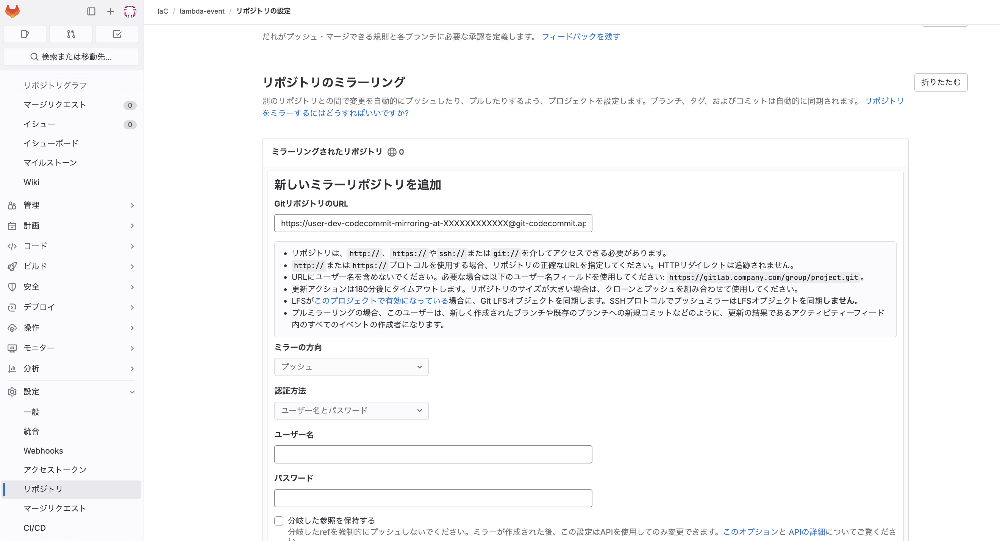

# Cloudformation用のcodepipelineを作成する
gitlabでIaCを開発して、特定のブランチにマージすることで環境に自動でデプロイされるGitOpsを実現する。  
そのためにCodeSeriesをAWSに作成し、CICDの環境を整え、gitlabとCICD環境を連携する。


## 前提
前提
- 環境がdev/prdの2環境存在
- developmentブランチにマージするとdevへリリース
- masterブランチにマージするとprdへリリース

上記を踏まえ、変数とマッピングを準備しておく。
- 変数
    - EnvID
        - 環境名を作成されるリソースに付与する
        - 例えばdev環境に作成する場合はdevにすることで
            - devと名前がついたCodeSeriesが作成される
            - Pipelineはdevelopmentブランチを監視する
    - ProjectID
        - CFNで管理する単位を作成されるリソースに付与する
        - 例えばSyoriAと言う名前を付与することで
            - SyoriAと名前がついたCodeSeriesが作成される
- マッピング
    - ブランチはmasterとprd環境を紐づけている
    - prdと言うEnvIDを付与したときに、masterブランチを監視させる
    - このマッピングを利用すれば、どの環境にどのブランチを紐づけるか制御できる
    - Mappingが利用されているのはCodePipelineとEventの部分


```yaml
# ------------------------------------------------------------#
# Parameters
# ------------------------------------------------------------#
Parameters:
    EnvID:
      Type: String
      AllowedValues: [ dev, prd ]
    ProjectID:
      Type: String


# ------------------------------------------------------------#
# Mappings
# ------------------------------------------------------------#
Mappings:
  BranchMap:
    dev:
      "name": "development"
    prd:
      "name": "master"
```


## codecommitの作成
gitlabで開発したテンプレートファイルをAWS上に同期するために、gitlabとcodecommitをミラーリングする。
ミラーリングすることで、開発自体は多機能のgitlabで行うことができる。
### codecommitの作成
codecommit自体は、リポジトリNameを指定すれば作成される。
```yaml
  # --------------------------------------------------------#
  # CodeCommit
  # --------------------------------------------------------#
  CodeCommitCFN:
    Type: AWS::CodeCommit::Repository
    Properties: 
        RepositoryName: !Sub "codecommit-${EnvID}-cfn-${ProjectID}"
        RepositoryDescription: "CFn Code Repo Mirrored from GitLab"
    Tags:
        - Key: "CreatedBy"
            Value: !Ref "AWS::StackName"
```

### ミラーリング用のユーザー作成
codecommitとgitlabをミラーリングさせるために認証設定が必要となる。
具体的には、codecommitへのアクセス権限のみを持つIAMポリシーを作成し、このポリシーのみをもつIAMユーザーを作成します。
```yaml
  CodeCommitUser:
    Type: 'AWS::IAM::User'
    Properties:
      UserName: !Sub 'user-${EnvID}-codecommit-mirroring'
      Tags:
        - Key: "CreatedBy"
          Value: !Ref "AWS::StackName"


  CodeCommitPolicy:
    Type: 'AWS::IAM::Policy'
    Properties:
      PolicyName: !Sub 'policy-${EnvID}-codecommit-mirroring'
      PolicyDocument:
        Version: '2012-10-17'
        Statement:
          - Effect: 'Allow'
            Action:
              - 'codecommit:GitPull'
              - 'codecommit:GitPush'
            Resource: '*'
      Users:
        - !Ref CodeCommitUser
```

このユーザーで認証情報を払い出し、この認証情報をgitlab側に設定することで、gitlabで加えられた変更をcodecommitに反映することができる。
codecommit用の認証情報払い出し方法は以下でPasswordは自分でメモしておく。  
また、IAMUserのスタックを削除する際に、払い出した情報が残っていると削除に失敗するので、削除する場合は、先に消しておく。
```
aws iam create-service-specific-credential --user-name <User_Name> --service-name codecommit.amazonaws.com
{
    "ServiceSpecificCredential": {
……
        "ServiceName": "codecommit.amazonaws.com",
        "ServiceUserName": "xxxxxxxxxxxx",
        "ServicePassword": "xxxxxxxxxxxx",
……
    }
}
```


### ミラーリング設定
codecommitでHTTPSのURLを取得し、`ServiceUserName@`をhtts://の後ろに挿入
```
# 取得したHTTPSのgitURL
https://git-codecommit.ap-northeast-1.amazonaws.com/v1/repos/codecommit-dev-cfn-ProjectX

# 挿入後
https://user-dev-codecommit-mirroring-at-XXXXXXXXXXXX@git-codecommit.ap-northeast-1.amazonaws.com/v1/repos/codecommit-dev-cfn-ProjectX
```

gitlab側で、設定からミラーリポジトリを開いて、各種情報を設定してミラーリングを行う。

- URL：上記で作成した挿入後のURL
- ユーザー名：ServiceUserName
- パスワード：ServicePassword


## CodeSeriesに付与するRole
CodeSeriesを利用してCICD Pipelineを作成するにあたり、登場するRoleの役割を整理し、概論を述べておく。

### ビルドステージ Role
- Codepipelineで設定しているArtifactにアーティファクトをアップロードする必要があるため、S3へのアクセス権限が必要
- CodeBuildのログをcloudwatchのloggroupに配置する必要があるので、loggroupに関する権限が必要

### デプロイステージ Role
今回はデプロイステージがCFNなので、CFNを実行するためのRoleになる。そのため、CFNで作成するリソースに対する権限が必要になる。
気をつけなくてはいけないのは、更新やスタック作成失敗時のRollBackに備えて、リソースに対する削除の権限も付与する必要があるということである。
例えば今回は、CFNでLambdaとEventBridgeを作成する権限と削除する権限を付与する必要がある。

### CodePipeline Role
パイプラインが、ソースステージ、ビルドステージ、デプロイステージの実行者となる。そのため、各ステージにおける実行権限が必要である具体的には、以下
- アーティファクト
    - パイプラインの各ステージ間でアーティファクト（ビルドの成果物やソースコード）を一時的に格納するためのストレージを利用する
    - S3を指定する場合は、CodePipelineのRoleにS3に対する権限が必要
- ソースステージ
    - CodeCommitにアクセスをcodepipelineがするので、CodeCommitに対する権限が必要
- ビルドステージ
    - BuildProjectを事前に作成し、そのProjectを指定する形で実行する
    - Projectを作成する際に、ServiceRoleとしてRoleを設定するためPassRoleは不要
    - CodepipelineはビルドPJを指定して実行するのcodeBuildに対する権限は必要
- デプロイステージ
    - デプロイのタイプによるが、今回はCFNを利用する
    - codepipelineの中でCFNの設定を行い、Roleを指定するので、pipelineからcfnに対するPassRoleが必要になる
    - CFNの実行をcodepipelineが行うので、CFNに対する権限が必要


## Artifact用のS3作成
★★★★★未対応★★★★★

## codebuildの作成
### codebuild用のIAMRole作成
前述の通り、Policyにはlogへのアクセス権限とS3へのアクセス権限を付与しておく。
```yaml
  CodeBuildCFnRole:
    Type: AWS::IAM::Role
    Properties:
      Path: "/"
      RoleName: !Sub "role-${EnvID}-codebuild-cfn"
      AssumeRolePolicyDocument:
        Version: 2012-10-17
        Statement:
          - 
            Effect: Allow
            Principal:
              Service:
                - codebuild.amazonaws.com
            Action:
              - sts:AssumeRole
      MaxSessionDuration: 3600
      ManagedPolicyArns: 
        - !Ref CodeBuildCFnPolicy
      Description: "CodeBuild Base Role"
      Tags:
        - 
          Key: CreatedBy
          Value: !Ref "AWS::StackName"

  # Policy
  CodeBuildCFnPolicy:
    Type: "AWS::IAM::ManagedPolicy"
    Properties:
      ManagedPolicyName: !Sub "policy-${EnvID}-codebuild-cfn"
      Path: "/"
      PolicyDocument:
        Version: "2012-10-17"
        Statement:
          - 
            Effect: Allow
            Action:
              - logs:CreateLogGroup
              - logs:CreateLogStream
              - logs:PutLogEvents
            Resource: "*" #本来はBuildの出力先であるloggroupに絞る
          - 
            Effect: Allow
            Action:
              - s3:ListBucket
              - s3:PutObject
              - s3:GetObject
              - s3:GetObjectVersion
              - s3:GetBucketAcl
              - s3:GetBucketLocation
            Resource: "*" #本来はCodepipelineに指定したArtifactの出力先であるS3に絞る
      Description: ""
```
### Codebuildの作成
ビルドプロジェクトを作成しておく。このビルドPJをCodePipelineから呼び出す。
- Source
    - Type: ソースコードのタイプ、CODEPIPELINEを指定することで、CODEPIPELINEから受け取ることが設定できる
- Artifacts
    - アーティファクトの出力先で、CODEPIPELINEを指定することで、CODEPIPELINEのAritifactへ出力する
- Environment
    - EnvironmentVariables：buildspec.yamlなどに渡す環境変数
- LogsConfig
    - ログの配信場所で、S3やloggroupが設定できる
```yaml
  CodeBuildProjectCFN:
    Type: "AWS::CodeBuild::Project"
    Properties:
      Name: !Sub "codebuild-${EnvID}-cfn-${ProjectID}"
      Source: 
        InsecureSsl: false 
        Type: "CODEPIPELINE"
      Artifacts: 
        EncryptionDisabled: false
        Name: !Sub "codebuild-${EnvID}-cfn-${ProjectID}"
        Packaging: "NONE"
        Type: "CODEPIPELINE"
      Cache: 
        Type: "NO_CACHE"
      Environment: 
        ComputeType: "BUILD_GENERAL1_SMALL"
        Image: "aws/codebuild/standard:5.0"
        ImagePullCredentialsType: "CODEBUILD"
        PrivilegedMode: true
        Type: "LINUX_CONTAINER"
        EnvironmentVariables: 
          - 
            Name: "EnvID"
            Type: "PLAINTEXT"
            Value: !Ref EnvID
          - 
            Name: "AccountId"
            Type: "PLAINTEXT"
            Value: !Ref AWS::AccountId
      ServiceRole: !Sub "arn:${AWS::Partition}:iam::${AWS::AccountId}:role/role-${EnvID}-codebuild-cfn"
      TimeoutInMinutes: 60
      QueuedTimeoutInMinutes: 480
      EncryptionKey: !Sub "arn:${AWS::Partition}:kms:${AWS::Region}:${AWS::AccountId}:alias/aws/s3"
      BadgeEnabled: false
      LogsConfig: 
        CloudWatchLogs: 
          Status: "ENABLED"
        S3Logs: 
          Status: "DISABLED"
          EncryptionDisabled: false
      Visibility: "PRIVATE"
      Tags:
        - Key: "CreatedBy"
          Value: !Ref "AWS::StackName"
```


## デプロイステージの作成
### デプロイステージ用のIAMRole作成
デプロイステージのCFNが、lambdaとeventbridgeとIAMを作成したり、付与したりするので権限をつけておく。
```yaml
  CodeDeployCFnRole: 
    Type: AWS::IAM::Role
    Properties:
      Path: "/"
      RoleName: !Sub "role-${EnvID}-codedeploy-cfn"
      AssumeRolePolicyDocument:
        Version: 2012-10-17
        Statement:
          - 
            Effect: Allow
            Principal:
              Service:
                - cloudformation.amazonaws.com
            Action:
                - sts:AssumeRole
      MaxSessionDuration: 3600
      ManagedPolicyArns: 
        - !Ref CodeDeployCFnPolicy
      Description: "CodeDeploy Base service role"
      Tags:
        - 
          Key: CreatedBy
          Value: !Ref "AWS::StackName"

  # Policy
  CodeDeployCFnPolicy:
    Type: "AWS::IAM::ManagedPolicy"
    Properties:
      ManagedPolicyName: !Sub "policy-${EnvID}-codedeploy-cfn"
      Description: ""
      Path: "/"
      PolicyDocument:
        Version: "2012-10-17"
        Statement:
          - Effect: Allow
            Action:
              - 'lambda:CreateFunction'
              - 'lambda:UpdateFunctionCode'
              - 'lambda:GetFunction'
              - 'lambda:InvokeFunction'
              - 'lambda:DeleteFunction'
              - 'events:PutRule'
              - 'events:DeleteRule'
              - 'events:PutTargets'
              - 'events:RemoveTargets'
              - 'events:DescribeRule'
              - 'iam:CreateRole'
              - 'iam:AttachRolePolicy'
              - 'iam:PassRole'
              - 'iam:PutRolePolicy'
              - 'iam:DeleteRole'
              - 'iam:DetachRolePolicy'
              - 'iam:DeleteRolePolicy'
            Resource: '*'
```

### デプロイステージの作成
デプロイステージでは、CFNの実行を行う。CFNを実行する際に特殊な設定として`ActionMode`と`Capabilities`があるので理解しておくと良い。
Action ModeはCFNを実行する際に、すぐに更新するのか、チェンジセットを作ってから実行するかなど、実行方法を設定できる。
Capabilitiesは、CFNがリソースを制御すると言う強力な力を持っているので、勝手にIAMなどを作成しないように、CFN側でも許可する設定である。
- ActionMode:CFNを実行する際のモード
    - CREATE_UPDATE：スタックが存在しない場合新規作成、存在する場合は更新を行う
    - CHANGE_SET_REPLACE：スタックとテンプレートに基づいて、変更セットを作成する
    - CHANGE_SET_EXECUTE：変更セットを実行する
    - DELETE_ONLY：指定したスタックを削除する
    - REPLACE_ON_FAILURE：スタックがない場合は作成、スタックが以下の状態なら削除して作成、スタックがある場合は、更新。更新ロールバックでも削除されるのでテストで利用程度
        - ROLLBACK_FAILED（ロールバック失敗）
        - CREATE_FAILED（作成失敗）
        - DELETE_FAILED（削除失敗）
        - UPDATE_ROLLBACK_FAILED（更新ロールバック失敗）
- Capabilities: CFNが特定の操作を行うための必要な追加権限
    - CAPABILITY_IAM：CFNを利用してIAMを作成することができるようになる
    - CAPABILITY_NAMED_IAM：CFNを利用して、特定の名前を付与したIAMを作成することができるようになる
    - CAPABILITY_AUTO_EXPAND：NestedStackなどを作成することができるようになる

```yaml
Name: "Deploy"
Actions: 
    - 
    Name: "Deploy"
    ActionTypeId: 
        Category: "Deploy"
        Owner: "AWS"
        Provider: "CloudFormation"
        Version: "1"
    Configuration: 
        ActionMode: "CREATE_UPDATE"
        Capabilities: "CAPABILITY_NAMED_IAM" 
        RoleArn: !Sub "arn:${AWS::Partition}:iam::${AWS::AccountId}:role/role-${EnvID}-codedeploy-cfn"
        StackName: !Sub "cfnstack-${EnvID}-lambda-app" #作成されるスタック名
        TemplatePath: "BuildArtifact::root-stack-lambda.yaml" #実行するテンプレートファイル
        TemplateConfiguration: "BuildArtifact::parameter.json" #実行時に利用するパラメータ一覧
    InputArtifacts: 
        - 
        Name: "BuildArtifact"
    Region: !Ref AWS::Region
    Namespace: "DeployVariables"
    RunOrder: 1
```


## codepipelineの作成
### codedepipeline用のIAMRole作成
[公式サイト](https://docs.aws.amazon.com/ja_jp/codepipeline/latest/userguide/security-iam.html#how-to-custom-role)を引用して作成すると良い。
ただし、PassRoleの権限が強いので、以下のようにする方が推奨と思われる。
```yaml
  # ----------------------------------------------------------#
  # CodePipeline
  # ----------------------------------------------------------#
  # Role
  CodePipelineCFnRole:
    Type: AWS::IAM::Role
    Properties:
      Path: "/"
      RoleName: !Sub "role-${EnvID}-codepipeline-cfn"
      AssumeRolePolicyDocument:
        Version: 2012-10-17
        Statement:
          - 
            Effect: Allow
            Principal:
              Service:
                - codepipeline.amazonaws.com
            Action:
              - sts:AssumeRole
      MaxSessionDuration: 3600
      ManagedPolicyArns: 
        - !Ref CodePipelineCFnPolicy
      Description: "Pipeline Role for CFn Stack"
      Tags:
        - 
          Key: CreatedBy
          Value: !Ref "AWS::StackName"

  # Policy
  # https://docs.aws.amazon.com/ja_jp/codepipeline/latest/userguide/security-iam.html#how-to-custom-role
  CodePipelineCFnPolicy:
    Type: "AWS::IAM::ManagedPolicy"
    Properties:
      ManagedPolicyName: !Sub "policy-${EnvID}-codepipeline-cfn"
      Description: ""
      Path: "/"
      PolicyDocument:
        Version: "2012-10-17"
        Statement:
          - #ArtifactのためのS3に対する権限
            Effect: Allow
            Action:
              - s3:PutObject
              - s3:GetObject
              - s3:GetObjectVersion
              - s3:GetBucketAcl
              - s3:GetBucketLocation
            Resource: "*" #本来は対象のバケットに絞る

          - #CodeCommitに対する権限
            Effect: Allow
            Action:
              - codecommit:CancelUploadArchive 
              - codecommit:GetBranch
              - codecommit:GetCommit
              - codecommit:GetRepository
              - codecommit:GetUploadArchiveStatus
              - codecommit:UploadArchive
            Resource: "*" #本来は対象のCodeCommitに絞る

          - #CodeBuildに対する権限
            Effect: Allow
            Action:
              - codebuild:BatchGetBuilds
              - codebuild:StartBuild
            Resource: "*" #本来は対象のBuildPJに絞る

          - #CodePipelineがCFNに対してPassRoleの権限
            Effect: Allow
            Action:
              - iam:PassRole
            Resource:
              - "*" #本来はCFNに付与するRoleを絞る
            Condition: #CFNだけにPassRoleするように制限
              StringEqualsIfExists:
                iam:PassedToService:
                  - cloudformation.amazonaws.com

          - #CodePipelineがCFNを実行するための権限
            Effect: Allow
            Action:
              - cloudformation:CreateStack
              - cloudformation:DeleteStack
              - cloudformation:DescribeStacks
              - cloudformation:UpdateStack
              - cloudformation:CreateChangeSet
              - cloudformation:DeleteChangeSet
              - cloudformation:DescribeChangeSet
              - cloudformation:ExecuteChangeSet
              - cloudformation:SetStackPolicy
              - cloudformation:ValidateTemplate
            Resource:
              - "*" #本来は対象のCFNに絞る
```


### Codedepipelineの作成
#### Pipelineの設定
ArtifactStoreで、各ステージの成果物を配置するストレージを指定する。今回はS3を指定。
```yaml
  CodePipelineCFN:
    Type: "AWS::CodePipeline::Pipeline"
    Properties:
      Name: !Sub "codepipeline-${EnvID}-cfn-${ProjectID}"
      RoleArn: !Sub "arn:${AWS::Partition}:iam::${AWS::AccountId}:role/role-${EnvID}-codepipeline-cfn"
      ArtifactStore: 
        Location: !Sub "s3-iac-fujishiroms-${EnvID}-codepipeline-artifact"
        Type: "S3"
```


#### ソースステージの設定
ステージでは、CodeCommitを指定して、設定として、どのブランチを監視するかを指定することができる。
```yaml
          Name: "Source"
          Actions: 
            - 
              Name: "Source"
              ActionTypeId: 
                Category: "Source"
                Owner: "AWS"
                Provider: "CodeCommit"
                Version: "1"
              Configuration: 
                BranchName: !FindInMap [ BranchMap, !Ref EnvID, name ]
                OutputArtifactFormat: "CODE_ZIP"
                PollForSourceChanges: "false" #今回トリガーはEvent Bridgeのためfalse
                RepositoryName: !GetAtt CodeCommitCFN.Name 
              OutputArtifacts: 
                - 
                  Name: "SourceArtifact" #ソースステージのアウトプットArtifact
              Region: !Ref AWS::Region
              Namespace: "SourceVariables"
              RunOrder: 1
```

#### ビルドステージの設定
事前に作成してビルドPJを利用して実行する。
```yaml
        - 
          Name: "Build"
          Actions: 
            - 
              Name: "Build"
              ActionTypeId: 
                Category: "Build"
                Owner: "AWS"
                Provider: "CodeBuild"
                Version: "1"
              Configuration: 
                ProjectName: !Ref CodeBuildProjectCFN
              InputArtifacts: 
                - 
                  Name: "SourceArtifact"
              OutputArtifacts: 
                - 
                  Name: "BuildArtifact"
              Region: !Ref AWS::Region
              Namespace: "BuildVariables"
              RunOrder: 1
```
#### 承認ステージの設定
手動での承認プロセスを挟むことで、意図しないPushなどによるデプロイを防ぐことができる。
```yaml
          - 
            Name: "Approval"
            Actions: 
              - 
                Name: "Approval"
                ActionTypeId: 
                  Category: "Approval"
                  Owner: "AWS"
                  Provider: "Manual"
                  Version: "1"
                Configuration: 
                  NotificationArn: !Sub "arn:${AWS::Partition}:sns:${AWS::Region}:${AWS::AccountId}:sns-${EnvID}-codepipeline-approval-SRE"
                Region: !Ref AWS::Region
                RunOrder: 1
```

#### デプロイステージの設定
前セクション：デプロイステージの作成を参照


## Eventの作成
### codedepipeline用のIAMRole作成
- Roleの引き受け：events.amazon.com
- 権限：CodePipelineを実行するための権限

```yaml
  EventsRuleRole:
    Type: AWS::IAM::Role
    Properties:
      Path: "/"
      RoleName: !Sub "role-${EnvID}-eventbridge-codepipeline-exec"
      AssumeRolePolicyDocument:
        Version: 2012-10-17
        Statement:
          - 
            Effect: Allow
            Principal:
              Service:
                - events.amazonaws.com
            Action:
              - sts:AssumeRole
      MaxSessionDuration: 3600
      ManagedPolicyArns: 
        - !Ref EventsCodepipelineExecPolicy
      Description: "Role for eventbridge codepipeline exec"
      Tags:
        - 
          Key: CreatedBy
          Value: !Ref "AWS::StackName"

  EventsCodepipelineExecPolicy:
    Type: "AWS::IAM::ManagedPolicy"
    Properties:
      ManagedPolicyName: !Sub "policy-${EnvID}-eventbridge-codepipeline-exec"
      Path: "/"
      PolicyDocument:
        Version: "2012-10-17"
        Statement:
          - Effect: Allow
            Action:
              - codepipeline:StartPipelineExecution
            Resource:
              - "*"
      Description: "Policy for eventbridge codepipeline exec"


```
### Eventの作成
EventBridgeを利用して、特定のイベントが発生したときに、指定されたターゲット（この場合はAWS CodePipeline）をトリガーする設定を行う。

```yaml
  EventsRule:
    Type: AWS::Events::Rule
    Properties: 
      Name: !Sub "event-rule-${EnvID}-codepipeline-exec-cfn-${ProjectID}"
      EventPattern: # Eventをトリガーするパターン
        source: #対象はcodecommit
          - aws.codecommit
        detail-type:
          - CodeCommit Repository State Change
        resources:
          - !GetAtt CodeCommitCFN.Arn 
        detail: #対象の中でのトリガー詳細
          event:
            - referenceUpdated #ブランチのアップデート
          referenceType:
            - branch
          referenceName:
            - !FindInMap [ BranchMap, !Ref EnvID, name ]
      Targets: #Eventが実行するのcodepipeline
        - Arn: !Sub "arn:${AWS::Partition}:codepipeline:${AWS::Region}:${AWS::AccountId}:${CodePipelineCFN}"
          Id: !Sub "codepipeline-${EnvID}-cfn-${ProjectID}"
          RoleArn: !Sub "arn:${AWS::Partition}:iam::${AWS::AccountId}:role/role-${EnvID}-eventbridge-codepipeline-exec"
```


# テンプレートファイル一覧
## CodeCommitのミラーリングのためのユーザー作成
```yaml
AWSTemplateFormatVersion: '2010-09-09'
Description: IAM user with CodeCommit access

# ------------------------------------------------------------#
# Parameters
# ------------------------------------------------------------#
Parameters:
    EnvID:
      Type: String
      AllowedValues: [ dev, prd ]

# ------------------------------------------------------------#
# Resources
# ------------------------------------------------------------#
Resources:

  CodeCommitUser:
    Type: 'AWS::IAM::User'
    Properties:
      UserName: !Sub 'user-${EnvID}-codecommit-mirroring'
      Tags:
        - Key: "CreatedBy"
          Value: !Ref "AWS::StackName"


  CodeCommitPolicy:
    Type: 'AWS::IAM::Policy'
    Properties:
      PolicyName: !Sub 'policy-${EnvID}-codecommit-mirroring'
      PolicyDocument:
        Version: '2012-10-17'
        Statement:
          - Effect: 'Allow'
            Action:
              - 'codecommit:GitPull'
              - 'codecommit:GitPush'
            Resource: '*'
      Users:
        - !Ref CodeCommitUser
```

## CodePipelineのテンプレートファイル
上記のCodeCommit/CodeBuild/CodeDeploy/CodePipelineを作成するテンプレートファイル
```yaml
AWSTemplateFormatVersion: "2010-09-09"

Description: "Codepipeline for lambda stack"

# ------------------------------------------------------------#
# Parameters
# ------------------------------------------------------------#
Parameters:
    EnvID:
      Type: String
      AllowedValues: [ dev, prd ]
    ProjectID:
      Type: String


# ------------------------------------------------------------#
# Mappings
# ------------------------------------------------------------#
Mappings:
  BranchMap:
    dev:
      "name": "development"
    prd:
      "name": "master"
```

## Codeシリーズで利用されるIAMのテンプレートファイル
```
```
