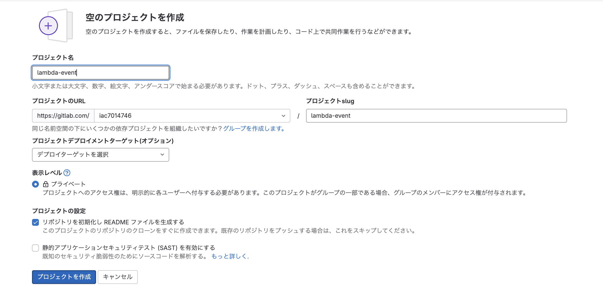

# LambdaとEvent作成フロー
## 開発環境準備
### gitlabのリポジトリ作成
lambdaとEventBridgeを作成するので、lambda-eventと言うリポジトリを作成する。
このリポジトリに、lambdaとEventBridgeを作成するテンプレートファイルを格納していく。

### ローカルでの開発準備
ローカルで開発をしていくために作成したPJをローカルにCloneする。

# スタックの作成
## Roleの作成
### Roleのスタック作成
### codedeployのRole修正
### codepipelineのRole確認

## Eventの作成
### Eventのスタック作成
### codedeployのRole確認

## Lambdaの作成
### Lambdaのスタック作成
### codedeployのRole確認
