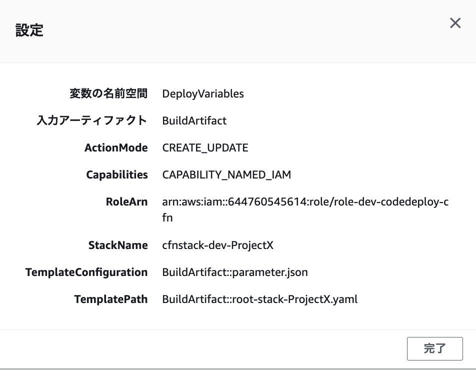

# LambdaとEvent作成フロー


## 全体感
CodePipelineで実行されるCFNの設定を確認する。こちらに合わせて、ソースコードの準備を行う。
- StackName：作成されるスタック名
- TemplateConfiguration: 実行されるCFNのテンプレートファイルに渡すparameterの値
- TemplatePath：実行されるCFNのテンプレートファイル名



### CFNのテンプレートファイル
TemplatePathが`root-stack-ProjectX`なので、この名前でテンプレートファイルを作成する。
今回は、Lambda/EventBridge/IAMを作成する。
### parameter
TemplateConfigurationが`parameter.json`なので、この名前でparameterファイルを設定する。

json形式で、root-stackに渡すパラメータを定義する。
環境によって変化する値、例えば環境名(dev/prd)などがある場合はbuildのタイミングで渡すことによって、parameter.jsonを増やさなくて済む。
parameter.jsonに対して、buildのタイミングで操作する場合、その操作内容をbuildspec.yamlで定義しておく。
### buildspec.yaml
ビルドステージで、実行されるコマンドを定義する。
- parameterに環境を埋め込む操作
- デプロイステージへtemplateファイルとparameterファイルをArtifactとして渡す


## Lambdaの作成
まずは、単純にHello Worldを発行するだけのLambdaを作成する。
### Lambdaのスタック作成
root-stack-ProjectXに対してLambdaとLambdaで利用するRoleを設定する。
```yaml
AWSTemplateFormatVersion: '2010-09-09'
Description: 'AWS CloudFormation Sample Template: Lambda function with IAM role and Hello World in Python.'

Parameters:
  EnvID:
    Type: String
    AllowedValues: [ dev, stg, prd ]


Resources:
  HelloLambdaFunction:
    Type: AWS::Lambda::Function
    Properties:
      FunctionName: !Sub "lambda-${EnvID}-hello"
      Handler: index.handler
      Role: !GetAtt LambdaExecutionRole.Arn
      Code:
        ZipFile: |
          def handler(event, context):
              print("Hello World!")
              return "Hello World"
      Runtime: python3.8

  LambdaExecutionRole:
    Type: AWS::IAM::Role
    Properties:
      AssumeRolePolicyDocument:
        Version: '2012-10-17'
        Statement:
        - Effect: Allow
          Principal:
            Service: lambda.amazonaws.com
          Action: 'sts:AssumeRole'
      Policies:
      - PolicyName: root
        PolicyDocument:
          Version: '2012-10-17'
          Statement:
          - Effect: Allow
            Action:
            - logs:CreateLogGroup
            - logs:CreateLogStream
            - logs:PutLogEvents
            Resource: '*'
      Tags:
        - 
          Key: CreatedBy
          Value: !Ref "AWS::StackName"
```


### parameter.json
rootstackには、パラメータとして、EnvIDを渡す必要があるので、parameter.jsonを以下のように設定する。
EnvIDの部分は、buildspec.yamlで与える。

```json
{
    "Parameters" : {
        "EnvID": "EnvID_FROM_BUILD" 
    }
}
```

### buildspec.yaml
- parameter.jsonに環境名を渡す設定を行う
    - $EnvIDはcodebuildを作成する時点で`EnvironmentVariables`として設定しているのでこれを渡す
- Artifactの設定
    - artifactセクションを設定することで、ここで設定した値がbuildのArtifactとして出力される
    - pipelineで設定している`OutputArtifacts`の`BuildArtifact`に設定される
```yaml
version: 0.2

phases:
  pre_build:
    commands:
      - sed -i 's/EnvID_FROM_BUILD/'"$EnvID"'/g' parameter.json
artifacts:
  files:
    - root-stack-ProjectX.yaml
    - parameter.json
```

### codedeploy確認
#### codedeployの設定
今回はIAMのRoleを作成するので、`Capabilities`が`CAPABILITY_NAMED_IAM`になっている必要がある
```yaml
 Configuration: 
    ActionMode: "CREATE_UPDATE"
    Capabilities: "CAPABILITY_NAMED_IAM" 
```


## Eventの作成
### Eventのスタック作成
5分ごとにLambdaを呼び出すEventを作成する。
```yaml
  EventBridgeRule:
    Type: AWS::Events::Rule
    Properties: 
      EventBusName: default
      Name: !Sub "eventbridge-${EnvID}-awake"
      ScheduleExpression: cron(*/5 * * * ? *)
      State: ENABLED
      Targets: 
        - Arn: !GetAtt HelloLambdaFunction.Arn
          Id: HelloLambdaFunction
```

Lambdaを実行するためには、リソースベースのようにLambda側でPermissionを付与してEventの呼び出しを許可する必要がある。
Event側にLambda Invokeの権限を付与するのは一般的ではないらしい。
```yaml
  # Lambdaに付与するPermission
  # Lambdaを呼び出すprincipalを設定することで呼び出しを許可する
  PermissionForEventsToInvokeLambda:
    Type: AWS::Lambda::Permission
    Properties:
      FunctionName: !Ref HelloLambdaFunction
      Action: lambda:InvokeFunction
      Principal: events.amazonaws.com
      SourceArn: !GetAtt 'EventBridgeRule.Arn'
```


## トラブルシューティング
### developmentブランチにマージしたが、Pipelineが実行されない。

Eventがうまく動作していない可能性が高いので、確認したいが、EventやPiplieneのページからは実行の履歴を確認できなかった。
CloudTrailを確認すると`StartPipelineExecution	codepipeline.amazonaws.com`を発見。中身は以下。
```json
{
    "eventSource": "codepipeline.amazonaws.com",
    "eventName": "StartPipelineExecution",
    "awsRegion": "ap-northeast-1",
    "sourceIPAddress": "events.amazonaws.com",
    "userAgent": "events.amazonaws.com",
    "errorCode": "AccessDenied",
    "errorMessage": "User: arn:aws:sts::XXXXXXXXXXX:assumed-role/role-dev-eventbridge-codepipeline-exec/057ffa15c4983c099eb1f9f09f268001 is not authorized to perform: codepipeline:StartPipelineExecution on resource: arn:aws:codepipeline:ap-northeast-1:XXXXXXXXXXX:codepipeline-dev-cfn-ProjectX because no identity-based policy allows the codepipeline:StartPipelineExecution action",
}
```
対象のPipelineについて、StartPipelineExecutionの権限がないらしい。

改めて、EventBridgeのPolicyをチェック
```yaml
  EventsCodepipelineExecPolicy:
    Type: "AWS::IAM::ManagedPolicy"
    Properties:
      ManagedPolicyName: !Sub "policy-${EnvID}-eventbridge-codepipeline-exec"
      Path: "/"
      PolicyDocument:
        Version: "2012-10-17"
        Statement:
          - Effect: Allow
            Action:
              - codepipeline:StartPipelineExecution
            Resource:
              - !Sub "arn:aws:events:${AWS::Region}:${AWS::AccountId}:rule/event-rule-${EnvID}-codepipeline-exec-cfn-${ProjectID}" #対象のEventに絞る
      Description: "Policy for eventbridge codepipeline exec"
```
Resourceがイベントになっていた。StartPipelineExecutionするので、ここのResourceはPipelineであるべき。
```yaml
            Resource:
              - !Sub arn:aws:codepipeline:${AWS::Region}:${AWS::AccountId}:codepipeline-${EnvID}-cfn-${ProjectID} #対象のPipelineに絞る
```


### Buildでエラー
`error while downloading key codepipeline-dev-cfn/SourceArti/M4CEgx3, error: AccessDenied: Access Denied`
S3に作成されたArtifactにアクセスできてない様子

codeBuildに付与されたPolicyをチェック
```yaml
  CodeBuildCFnPolicy:
    Type: "AWS::IAM::ManagedPolicy"
    Properties:
      ManagedPolicyName: !Sub "policy-${EnvID}-codebuild-cfn"
      Path: "/"
      PolicyDocument:
        Version: "2012-10-17"
        Statement:
          - 
            Effect: Allow
            Action:
              - logs:CreateLogGroup
              - logs:CreateLogStream
              - logs:PutLogEvents
            Resource: "*" #本来はBuildの出力先であるloggroupに絞る
          - 
            Effect: Allow
            Action:
              - s3:ListBucket
              - s3:PutObject
              - s3:GetObject
              - s3:GetObjectVersion
              - s3:GetBucketAcl
              - s3:GetBucketLocation
            Resource: !Sub "arn:aws:s3:::s3-${EnvID}-codepipeline-artifact" #Codepipelineで指定したArtifactの出力先であるS3に絞る
      Description: ""
```
S3のキーにアクセスするためには、`bucket/*`が必要なので追加

```yaml
Resource: 
    - !Sub "arn:aws:s3:::s3-${EnvID}-codepipeline-artifact" #Codepipelineで指定したArtifactの出力先であるS3に絞る
    - !Sub "arn:aws:s3:::s3-${EnvID}-codepipeline-artifact/*" #Codepipelineで指定したArtifactの出力先であるS3に絞る
```

### CFNの実行時にエラー
`Unknown property [[EnvID]] in template configuration`
TemplateConfigurationが間違っているっぽいので、確認する。S3にあるbuildArtiを確認すると以下
```json
{
    "EnvID": "dev" 
}
```

[公式ドキュメント](https://docs.aws.amazon.com/ja_jp/AWSCloudFormation/latest/UserGuide/continuous-delivery-codepipeline-basic-walkthrough.html)のサンプルをDLすると、Templateconfigは以下で設定する。
```json
{
  "Parameters" : {
        "EnvID": "dev" 
  }
}
```

