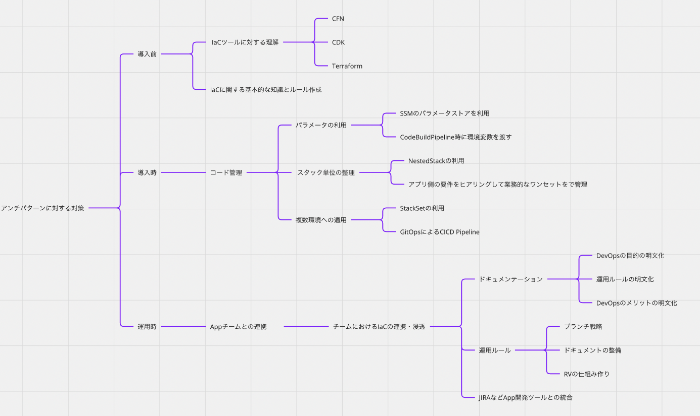

# 活動記録
## 10月
IaCの導入・運用に関する課題と対策を
[MIRO](https://miro.com/app/board/uXjVPgP397c=/?share_link_id=233118975605)に整理。
塾生メンバーとも課題感を議論し、それも踏まえて課題を整理しきる。
### IaCの導入・運用に向けた課題の洗い出し

### IaC導入・運用に向けた対策洗い出し

## 11月
### DevOpsの価値の理解を深めていく
- [DevOps導入指南](https://misakifujishiro.github.io/IAC_2023/record/book.html)を読みながら価値を整理
- DevOpsの価値とDevOpsを根付かせるためにはIaCや課題管理ツールの利用が重要である
- テーマや流れについて整理
### gitlabとjiraの利用方法をつかながら整理
- gitlabでできること
- gitlab利用した開発の基本フローを整理
### 改めてストーリーを考える
- 課題管理からソースコードの編集までの流れは整理できそうな雰囲気が出てきた。
- 改めて全体のストーリーをどうするのか
    - DevOpsには価値がある
    - DevOpsの文化醸成のためには IaCが重要
    - IaCの課題リストアップ
    - 重点ピックアップ課題
        - 業務課題とIacのソースコード修正の紐付け
        - Devチームが運用していくためにどのような準備をすればよいか
    - 業務課題とIacのソースコード修正の紐付け
        - gitlabやjiraとの連携
        - 運用フローの整理
    - Devチームが運用していくためにどのような準備をすればよいか
        - 宣言的であるメリット
        - Ifによる分岐はなるべく利用しない（ロジックは除く）
        - CICDのPipelineは必須で準備

## 12月
### ストーリー確定
ストーリーセクション参照

### gitlabとjiraの利用方法をつかながら整理
- jiraでできること
- jira利用した開発の基本フローを整理
- gitlabとjiraの組み合わせでできること
- 本格的にJIRAとgitlabのPJを連携してみる

### スターターセット作成開始
- codecommit【完了】
- codebuild【完了】
- codedeploy【完了】
- codepipeline
- Event
- S3
- IAM
    - Mirroring User
    - codebuild Role
    - CodeDeploy Role
    - CodePipeline Role
- スタック
    - Lambda-A
    - Lambda-B
    - Event-A
    - Event-B
    - Role

## 1月
### スターターセット作成完成

### デモストーリー検討

## 2月
### 運用しやすい IaCとは？

## 3月
- 発表練習

